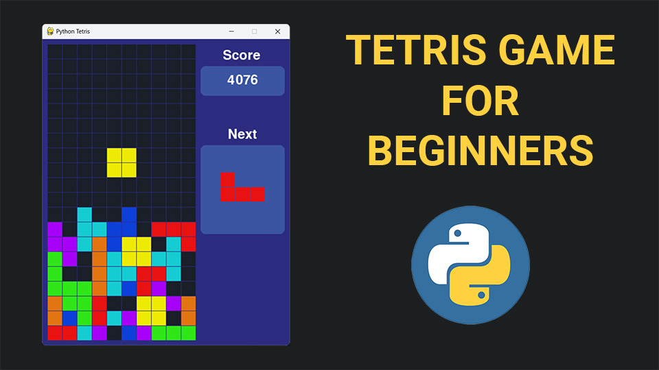

# Python Tetris Game using pygame

A fully functional Tetris game built with Python and pygame — featuring all 7 tetrominoes, rotation, collision detection, row clearing, scoring, a next-block preview, background music, and sound effects. The code is well-structured and class-based, making it a great resource for aspiring game developers.

  

  
  &nbsp;
  

---

## What you'll learn

The tutorial walks through the entire game from scratch in 13 steps, explaining every line of code along the way.

| | Topic | Details |
|---|---|---|
| 📦 | **Install pygame / pygame-ce** | Set up the library and verify it works |
| 🪟 | **Game loop & window setup** | Create the display surface, configure the frame rate, and structure the update/draw loop |
| 🟦 | **Grid class** | Represent the 20×10 board as a 2D list, draw cells with colour-coded values |
| 🧩 | **Block & tetromino classes** | Model all 7 tetrominoes using a bounding-grid approach across 4 rotation states |
| 🔄 | **Inheritance** | Use a base `Block` class with 7 child classes (`LBlock`, `IBlock`, `TBlock`, etc.) |
| ➡️ | **Movement & rotation** | Move blocks left, right, and down; rotate with state cycling and undo on invalid moves |
| 💥 | **Collision detection** | Boundary checking and cell-occupancy checks to prevent overlapping or out-of-bounds moves |
| 🔒 | **Block locking** | Lock a block into the grid when it can no longer move down and spawn the next block |
| 🧹 | **Row clearing** | Detect full rows, clear them, and shift all rows above downward |
| 🏆 | **Scoring** | Award 100 / 300 / 500 points for 1 / 2 / 3 line clears, plus 1 point per manual drop |
| 🖥️ | **UI** | Score display, next-block preview panel, and a Game Over message |
| 🔊 | **Audio** | Background music with looping, plus sound effects for rotation and row clears |
| 🔁 | **Game reset** | Restart the game on any key press after Game Over |

---

## How the game works

- The board is a **20-row × 10-column grid**, represented as a 2D list. Empty cells hold `0`; locked cells hold the block's colour ID (1–7).
- Each of the **7 tetrominoes** stores its occupied cell positions for all 4 rotation states in a dictionary. Rotation is handled by cycling a `rotation_state` index — no transform math required.
- A **`Game` class** ties everything together, holding the grid, the current block, and the next block, and exposing `move_left()`, `move_right()`, `move_down()`, `rotate()`, and `draw()` methods called from the main loop.
- Blocks are selected randomly, but each of the 7 appears once before any repeats — matching the behaviour of the original game.
- The game ends when a newly spawned block overlaps an already-locked cell. Press any key to restart.

---

## Prerequisites

- Basic knowledge of **Python** — loops, conditionals, functions, and classes
- **pygame** or **pygame-ce** installed (`pip install pygame-ce`)

> New to object-oriented programming in Python? The [Object Oriented Programming Made Easy course](https://programming-with-nick.thinkific.com/courses/Object%20Oriented%20Programming%20with%20Python) is a perfect companion to this project. If you're new to game development with pygame, the Pong and Snake tutorials (linked in the video description) are a good warm-up before tackling this project.

---

## Resources

🎥 [Video Tutorial on YouTube](https://youtu.be/nF_crEtmpBo)
&nbsp;&nbsp;|&nbsp;&nbsp;
📺 [My YouTube Channel](https://www.youtube.com/channel/UC3ivOTE5EgpmF2DHLBmWIWg)
